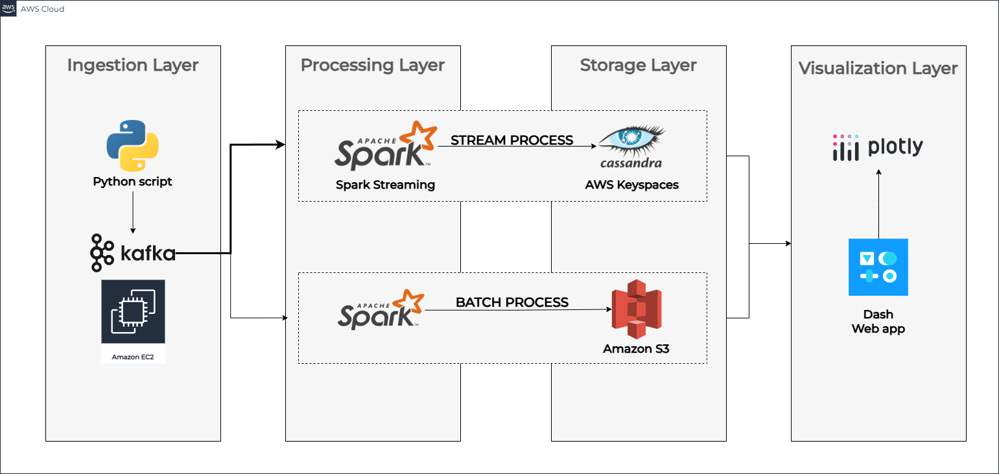

# Real-Time Data Streaming and Visualization Project

This project demonstrates real-time data streaming, processing, and visualization using Apache Kafka, PySpark, and Cassandra. The goal is to ingest, process, and visualize data  efficiently Dash on GitHub Pages.

## Overview

Here you want to write a short overview of the goals of your project and how it works at a high level. If possible, include one or two images of the end product and architecture diagram (see examples below). diagrams.net is a great tool for creating architecture diagrams.

<!-- ### Data Visualization

 -->

### Data Architecture



Data Ingestion:

I am using a python script to generate 2 logs/second and publish it to kafka  
Data is streamed into Kafka topics in real-time.
Kafka serves as the messaging layer between the data producers and consumers.

Data Processing:
PySpark Structured Streaming is used to process the data from Kafka in real-time with a 
trigger time of every 10 seconds.
Data is cleaned, transformed, and written to Amazon Keyspaces (Cassandra) for storage.

Data Visualization:
A Dash app is created to visualize the streaming data in real-time using callback to refresh the dashboard.
The app is converted to a static HTML file and hosted on GitHub Pages.


If you decide to include this, you should also talk a bit about why you chose the architecture and tools you did for this project.

I used kafka because it the best system for ingesting streaming data. similarly spark streaming provides a lot of support for streaming data use-cases
I used cassandra (or AWS Keyspaces) because I need a low latency fast storage and retrieval data store to support my real-time dashboard.

## Technologies Used

1. Data Streaming and Processing
Apache Kafka: For real-time data ingestion and message streaming.
PySpark Structured Streaming: For processing and transforming data streams.
2. Data Storage
Amazon Keyspaces (Cassandra): For storing processed data in a distributed, scalable manner.
3. Visualization
Dash: For building interactive dashboards and data visualization.
Plotly: For creating visually appealing and dynamic graphs.
4. Hosting
GitHub Pages: For hosting a static version of the Dash dashboard.

## Directory Structure
```
HOW SHOULD I STRUCTURE MY CODE? I have these files:
1) log-generation script which was running in the same ec2 as kafka
2) process-script which was on spark streaming ec2 along with a configuration file
3) one python script visualization.py which has the visualizations with dash web-app and plotly
4) then there are 2 config files one architecture diagram 
```

## Prerequisites

Directions needed for running the project under free tier on AWS.

- Launch 3 EC2 instances of t2.micro type from the AWS Console.
- Install and setup Kafka and zookeeper on 1st instance and create a topic named logs in Kafka
- Install and setup Spark on 2nd instance
- Install and setup Dash on 3rd instance

## Future Improvements

To make this project easier to deploy, replicate, and scale, the following enhancements are planned:

1. Cloud Infrastructure Automation with Terraform: Automate the provisioning of EC2 instances, Amazon Keyspaces, and other AWS resources.
2. Containerization with Docker: Use Docker containers to encapsulate various components like Kafka, Spark, and the Dash app.
3. Streamlined Deployment: Combine Terraform and Docker for end-to-end automation.

## Lessons Learned

It's good to reflect on what you learned throughout the process of building this project. Here you might discuss what you would have done differently if you had more time/money/data. Did you end up choosing the right tools or would you try something else next time?
